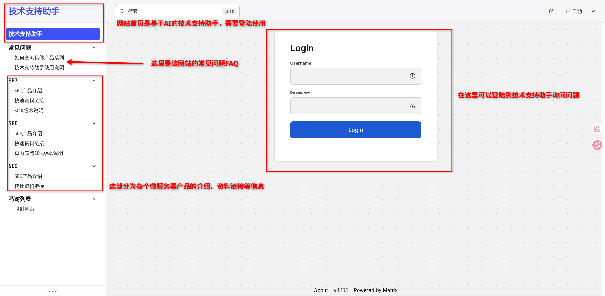
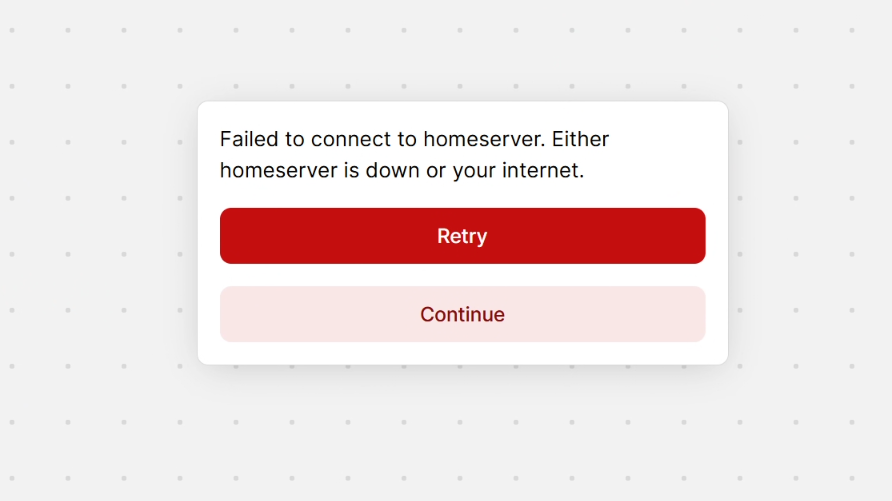
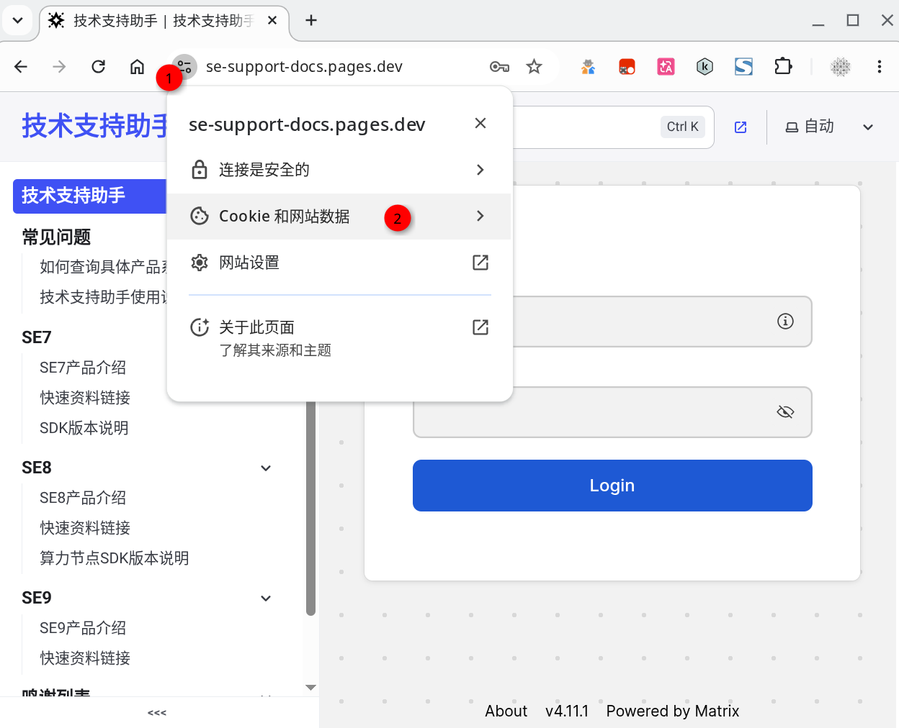
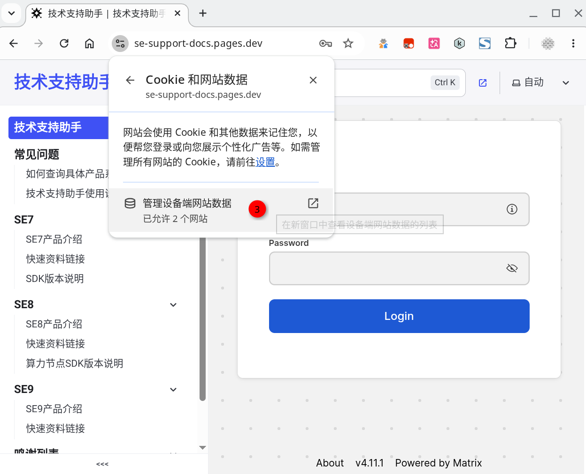
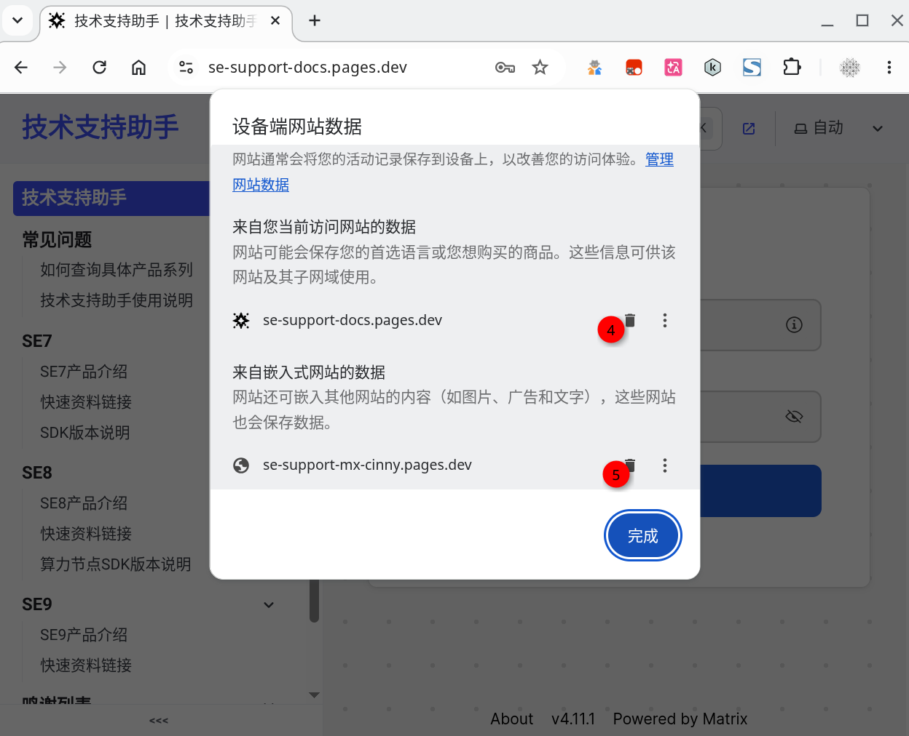

## 网页介绍

## 技术支持助手介绍

## 技术支持助手报错

### 报错一：Failed to connect to homeserver. Either homeserver is down or your internet.

**解决方案**：可以尝试按照如下流程删除浏览器缓存后重新打开网页

## 注意事项

1. 询问新问题前，请点击输入框左侧的按钮清空上下文。防止历史消息干扰
2. 询问问题前，请先确定问题对应的产品型号，选择正确的技术支持BOT后询问
