### 一、SE9如何加装存储？

答：

M.2 SSD 支持容量2TB(已验证)，为非标配配件，需要用户根据所需对接的运营商自行采购。

• 已验证2T 以下容量（额定功耗≤3W，功耗超出时可联系我司销售购买专用散热块）

• M.2 SSD 接口如图：

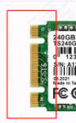

安装完成后，挂载硬盘后，可以正常使用。

具体请参考[《SE9用户指导手册》](https://sophon-file.sophon.cn/sophon-prod-s3/drive/25/05/16/09/%E7%AE%97%E8%83%BD%E6%99%BA%E8%83%BD%E5%BE%AE%E6%9C%8D%E5%8A%A1%E5%99%A8SE9%E7%94%A8%E6%88%B7%E6%8C%87%E5%AF%BC%E6%89%8B%E5%86%8C_20250512-v2.6.pdf)选件安装章节和硬盘挂载章节：

### 二、SE9如何加装4G/5G和LTE天线？

答：参考[《SE9用户指导手册》](https://sophon-file.sophon.cn/sophon-prod-s3/drive/25/05/16/09/%E7%AE%97%E8%83%BD%E6%99%BA%E8%83%BD%E5%BE%AE%E6%9C%8D%E5%8A%A1%E5%99%A8SE9%E7%94%A8%E6%88%B7%E6%8C%87%E5%AF%BC%E6%89%8B%E5%86%8C_20250512-v2.6.pdf)LTE天线章节

### 三、在哪里添加SE9的4G/5G、WIFI、BT、SATA模块，如何使用？

答：使用方法参考[《SE9用户指导手册》](https://sophon-file.sophon.cn/sophon-prod-s3/drive/25/05/16/09/%E7%AE%97%E8%83%BD%E6%99%BA%E8%83%BD%E5%BE%AE%E6%9C%8D%E5%8A%A1%E5%99%A8SE9%E7%94%A8%E6%88%B7%E6%8C%87%E5%AF%BC%E6%89%8B%E5%86%8C_20250512-v2.6.pdf)4G/5G模组使用、WIFI/BT模组使用、M.2 SSD的安装章节

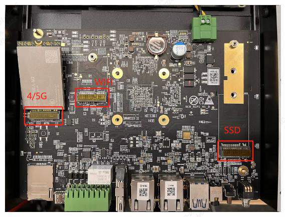

### 四、SE9如何刷新固件？

答：

常用的有两种方式：

1、使用sdcard卡刷方式。参考[《SE9用户指导手册》](https://sophon-file.sophon.cn/sophon-prod-s3/drive/25/05/16/09/%E7%AE%97%E8%83%BD%E6%99%BA%E8%83%BD%E5%BE%AE%E6%9C%8D%E5%8A%A1%E5%99%A8SE9%E7%94%A8%E6%88%B7%E6%8C%87%E5%AF%BC%E6%89%8B%E5%86%8C_20250512-v2.6.pdf)系统升级章节

2、OTA方式，其中OTA升级方式有以下两种：

①使用界面登录sophliteos系统，进行软件升级。参考[《SE9用户指导手册》](https://sophon-file.sophon.cn/sophon-prod-s3/drive/25/05/16/09/%E7%AE%97%E8%83%BD%E6%99%BA%E8%83%BD%E5%BE%AE%E6%9C%8D%E5%8A%A1%E5%99%A8SE9%E7%94%A8%E6%88%B7%E6%8C%87%E5%AF%BC%E6%89%8B%E5%86%8C_20250512-v2.6.pdf)软件升级章节

②将sdcard包的内容手动拷贝到SE9盒子/data/ota目录下，进入超级用户sudo su，再执行./local_update.sh md5.txt.

待SE9指示灯STAT变绿或界面、终端提示重启，断电重启，完成固件的刷新。

注意：OTA方式适合在小版本之间升级。如果版本跨度较大，建议使用sdcard卡刷方式升级。

### 五、SE9如何使用串口调试？

答：准备一条USB Type-c 接口的数据线，在笔记本电脑或台式电脑上安装串口驱动[CP210X](https://www.silabs.com/developers/usb-to-uart-bridge-vcp-drivers?tab=downloads)，使用USB Type-c线连接SE9的TYPE-C口与电脑，设置波特率115200。再给SE9上电，进入串口通讯界面，即可开始对SE9进行操作。原始账号和密码默认均为linaro。

### 六、SE9常用命令参考

答：

| 说明                                                         | 方法或命令                                                   |
| ------------------------------------------------------------ | ------------------------------------------------------------ |
| 用于获取设备基本信息，包括IP 地址、MAC 地址、系统开机时间、板卡温度、芯片结温，NPU 使用率等。 | bm_get_basic_info                                            |
| 用于查看设备版本信息。                                       | bm_version                                                   |
| 用于获取设备温度信息，包括板卡温度、芯片结温等。             | bm_get_temperature                                           |
| 用于设置静态IP。                                             | bm_set_ip                                                    |
| 用于设置动态IP。                                             | bm_set_ip_auto                                               |
| 检测驱动是否安装                                             | lsmod                                                        |
| 查看TPU使用率                                                | bm-smicat /sys/class/bm-tpu/bm-tpu0/device/npu_usage         |
| 查看VPU利用率                                                | cat /proc/soph/vpuinfo，其中前两个是解码核，后一个是编码核   |
| 当前设备芯片结温                                             | cat /sys/class/thermal/thermal_zone0/temp                    |
| 用于获取产品信息                                             | cat /factory/OEMconfig.ini                                   |
| 查看VPP预留内存的情况                                        | sudo cat /sys/kernel/debug/ion/cvi_vpp_heap_dump/summary \| head -3 |
| 查看TPU预留内存的情况                                        | sudo cat /sys/kernel/debug/ion/cvi_npu_heap_dump/summary \| head -3 |
| 查询系统内存                                                 | free –h                                                      |
| 查看tpu频率                                                  | cat /sys/kernel/debug/clk/clk_summary  \| grep tpu           |

如何测试模型可用性，性能，对比测试？

答：参考[《BMRuntime开发参考手册》bmrt_test工具使用及bmodel验证](https://doc.sophgo.com/bm1688_sdk-docs/v2.0/docs_latest_release/docs/tpu-runtime/reference/bmrt_test/bmrt_test.html)

如何查看、合并、分解、拆分模型？

答：参考[《BMRuntime开发参考手册》tpu_model使用](https://doc.sophgo.com/bm1688_sdk-docs/v2.0/docs_latest_release/docs/tpu-runtime/reference/bmodel/bmodel.html#tpu-model)

### 七、如何连接SE9？

答：有三种方式查看SE9 IP。

- 在显示器上直接查看IP的方式：

SE9连上网线，插上HDMI线，HDMI连接显示器，在显示器上查看IP，再使用ssh工具连接SE9；

- 通过SE9 LAN口连接查看IP的方式：

1. 连接SE9 LAN口至电脑端LAN口
2. 配置电脑ip地址至192.168.150.1同网段下，例如ip设为192.168.150.2，子网掩码设为255.255.255.0，默认网关设为192.168.150.254
3. ssh至192.168.150.1，初始账户名密码均为linaro
4. 查看SE9盒子的WAN口ip地址，以用来远程连接

- 用串口type-c连进去查看。(安装[CP210X](https://www.silabs.com/developers/usb-to-uart-bridge-vcp-drivers?tab=downloads)驱动，用串口工具连接，波特率115200)

### 八、SE9如何修改IP？

答：SE9搭载的是ubuntu系统，配置文件在/etc/netplan/01-netcfg.yaml文件中。WAN IP地址修改有多种方式。

- 使用netplan工具来配置网络接口的静态IP地址


修改/etc/netplan/01-netcfg.yaml：

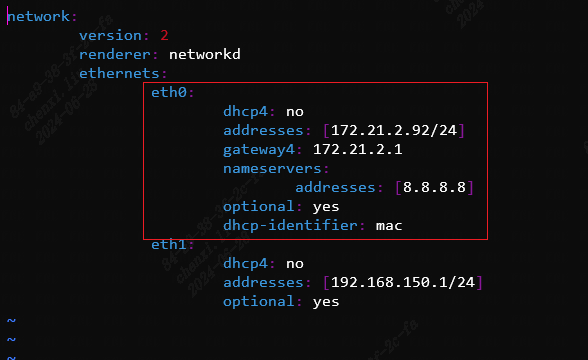

将上图内容保存后，应用配置

```
sudo netplan apply
```

这将把eth0接口配置为静态IP：172.21.2.92，同时制定了网关和DNS服务器。

*更多详细配置信息，可以查询netplan工具的使用，与PC版ubuntu系统是一样的。*

- 参考[《SE9用户指导手册》](https://sophon-file.sophon.cn/sophon-prod-s3/drive/25/05/16/09/%E7%AE%97%E8%83%BD%E6%99%BA%E8%83%BD%E5%BE%AE%E6%9C%8D%E5%8A%A1%E5%99%A8SE9%E7%94%A8%E6%88%B7%E6%8C%87%E5%AF%BC%E6%89%8B%E5%86%8C_20250512-v2.6.pdf)网络设置章节

### 九、如何修改内存布局？

答：请参考《SE9内存布局修改套件指导文档.pdf》或[内存布局修改工具说明文档](https://github.com/sophgo/sophon-tools/tree/main/source/pmemory_edit)，SoC模式内存修改工具(memory_edit_x.xx.tar.xz)下载链接：https://github.com/sophgo/sophon-tools/releases

注：SE9把vpu和vpp合成vpss，vpu固定为0，修改vpp即可，例：

```Bash
./memory_edit.sh -c -npu 2048 -vpu 0 -vpp 4096
```

### 十、如何制作刷机包？

答：有两种方式，一种是通过github代码构建安装包，另一种是基于sdcard.tgz基础软件包定制化。

- 参考《算能边缘产品BSP开发参考手册》构建安装包
- 使用socbak工具制作(参考：[socbak工具说明文档](https://github.com/sophgo/sophon-tools/tree/main/source/psocbak)，(socbak.zip)下载链接：https://github.com/sophgo/sophon-tools/releases)

### 十一、SE9盒子上自带的几个服务是做什么的？

答：

| 服务       | 说明                                                         |
| ---------- | ------------------------------------------------------------ |
| SophonHDMI | HDMI显示                                                     |
| sophliteos | 设备管理软件前端，分为技术运维和算法模块，基础运维功能可用，算法模块需要收费 |
| bmssm      | 设备管理软件，采用目录的形式管理资源，通过HTTP协议管理所有的系统的软硬件信息 |

如果需要关闭这些服务，可使用如下命令

```bash
sudo systemctl stop SophonHDMI
sudo systemctl disable SophonHDMI

sudo systemctl stop sophliteos
sudo systemctl disable sophliteos

sudo systemctl stop bmssm
sudo systemctl disable bmssm

# 删掉或者重命名.bak即可
/bin/bmssm /bin/sophliteos /bin/SophonHDMI
或在/usr/sbin/bmrt_setup.sh里注释掉对应代码，注释内容如下图 

disable服务后，再删掉/etc/systemd/system下的服务，重启后服务就不会自动起来了
```

### 十二、SE9设备是否有看门狗？在cpu、内存爆满后，盒子就处于假死状态了

答：watchdog默认是在内核开启的。使用这命令开watchdog：

```Bash
#手动关闭一次看门狗
echo V > /dev/watchdog0

# -t 是是喂狗周期， -T是时长
sudo busybox watchdog -t 3 -T 5 /dev/watchdog0

#如果要出发watchdog , 需要kiil掉watchdog这个工具的进程
```

请参考[《算能边缘产品BSP开发参考手册》Watchdog操作指南](https://doc.sophgo.com/bm1688_sdk-docs/v2.1/docs_latest_release/docs/athena2-img/4_system_software_composition.html#watchdog)

### 十三、如何查看SN/MAC？

答：用命令查看。其中device_sn为设备整机sn。

```Bash
cat /factory/OEMconfig.ini
```

### 十四、查看内存情况

答：

```Bash
# 系统内存
free -h
# vpp内存，用于解码、算法预处理
sudo cat /sys/kernel/debug/ion/cvi_vpp_heap_dump/summary | head -3
# TPU内存，用于模型推理
sudo cat /sys/kernel/debug/ion/cvi_npu_heap_dump/summary | head -3
```

### 十五、SE9上QT编译

答：参考《SE9 QT编译.pdf》

### 十六、程序编译，如何快速从1684/1684X转到CV186AH/BM1688？

答：参考[《BM1688_CV186AH SOPHONSDK开发指南》附录BM1684(X)_to_BM1688(CV186AH)兼容性文档](https://doc.sophgo.com/bm1688_sdk-docs/v2.0/docs_latest_release/docs/BM1688_CV186AH_SophonSDK_doc/Appendix/8_compatibility_doc.html)

### 十七、如何在命令行使用ffmpeg取USB摄像头视频流？

答：使用sophon-ffmpeg读取USB摄像头视频流，具有硬件加速功能

```Bash
ffmpeg -f v4l2 -pix_fmt mjpeg -s:v 1920x1080 -r 30 -zero_copy 0 -c:v jpeg_bm -i /dev/video6 -is_dma_buffer 1 -vf scale_bm=format=yuv420p:zero_copy=1 -r 25 -c:v h264_bm -b:v 3M -f flv rtmp://localhost/webcam/screen
```

### 十八、如何在命令行使用ffmpeg读取alsa音频？

答：alsa为软件功能，无硬件加速。

```Bash
ffmpeg -f alsa -i hw:0 -t 30 out.wav
```

### 十九、如何使用python版sophon-opencv？

答：

```Bash
export PYTHONPATH=$PYTHONPATH:/opt/sophon/sophon-opencv-latest/opencv-python 
```

### 二十、如何将bm_image转为cv.Mat?

答：

- Python中cv.Mat就是一个**numpy**.array，请参考[《SAIL使用手册》](https://doc.sophgo.com/bm1688_sdk-docs/v2.1/docs_latest_release/docs/sophon-sail/docs/)接口：asmat、asnumpy、mat_to_bm_image、bm_image_to_tensor、tensor_to_bm_image接口
- C++中使用cv::bmcv::toMat()接口。

### 二十一、sophon-opencv的版本？

答：基于开源opencv 4.8.0版本改造。1684/1684x上是基于4.1.0

### 二十二、sophon-ffmpeg的版本？

答：基于开源ffmpeg 6.0.0版本改造。1684/1684x上是基于5.0.0

### 二十三、GPIO使用，如何输出开关量信号？

答：参考[《BSP开发参考手册》GPIO操作指南](https://doc.sophgo.com/bm1688_sdk-docs/v2.1/docs_latest_release/docs/athena2-img/4_system_software_composition.html#gpio)和[《SE9用户指导手册》](https://sophon-file.sophon.cn/sophon-prod-s3/drive/25/05/16/09/%E7%AE%97%E8%83%BD%E6%99%BA%E8%83%BD%E5%BE%AE%E6%9C%8D%E5%8A%A1%E5%99%A8SE9%E7%94%A8%E6%88%B7%E6%8C%87%E5%AF%BC%E6%89%8B%E5%86%8C_20250512-v2.6.pdf)GPIO使用方法章节

### 二十四、继电器使用方法

答：参考[《SE9用户指导手册》](https://sophon-file.sophon.cn/sophon-prod-s3/drive/25/05/16/09/%E7%AE%97%E8%83%BD%E6%99%BA%E8%83%BD%E5%BE%AE%E6%9C%8D%E5%8A%A1%E5%99%A8SE9%E7%94%A8%E6%88%B7%E6%8C%87%E5%AF%BC%E6%89%8B%E5%86%8C_20250512-v2.6.pdf)继电器使用章节

继电器常态COM接NC，COM接NO时系统短路，掉电重启

继电器：GPIO198。GPIOOUT1：GPIO0。GPIOOUT2：GPIO1。

### 二十五、CAN使用方法

答：参考[《BSP开发参考手册》CAN操作指南](https://doc.sophgo.com/bm1688_sdk-docs/v2.1/docs_latest_release/docs/athena2-img/4_system_software_composition.html#can)和[《SE9用户指导手册》](https://sophon-file.sophon.cn/sophon-prod-s3/drive/25/05/16/09/%E7%AE%97%E8%83%BD%E6%99%BA%E8%83%BD%E5%BE%AE%E6%9C%8D%E5%8A%A1%E5%99%A8SE9%E7%94%A8%E6%88%B7%E6%8C%87%E5%AF%BC%E6%89%8B%E5%86%8C_20250512-v2.6.pdf)CAN使用方法章节

### 二十六、485/232使用方法?

答：参考[《SE9用户指导手册》](https://sophon-file.sophon.cn/sophon-prod-s3/drive/25/05/16/09/%E7%AE%97%E8%83%BD%E6%99%BA%E8%83%BD%E5%BE%AE%E6%9C%8D%E5%8A%A1%E5%99%A8SE9%E7%94%A8%E6%88%B7%E6%8C%87%E5%AF%BC%E6%89%8B%E5%86%8C_20250512-v2.6.pdf)485/232使用方法章节

### 二十七、使用TPU-MLIR，设置混精度的层名后，混精度未生效？

答：设置不需要量化的层名时需要使用**mlir2onnx工具把.mlir转成.onnx**后，查看并设置对应层名。**注：若使用原始.onnx文件的层名，有可能设置无效。mlir2onnx工具使用如下：**`mlir2onnx.py -m xxx.mlir -o revert.onnx`

### 二十八、使用TPU-MLIR，FP32/FP16模型推理可以得到正确结果，INT8模型无法得到正确结果？

答：如果使用全网络层INT8量化时bmodel精度损失较大，就需要使用混合精度的方式，把用INT8精度损失较大的网络层转成FP32/16的方式来提升精度。使用混合精度量化的推荐方法：

1. 更新到最新版本的TPU-MLIR;
2. run_calibration阶段结束会自动生成一个混精度表，生成的文件名是shape_pattern_qtable，此表规定了哪些层不量化处理；
3. model_deploy阶段除了必要参数和--calibration_table外，另添加参数--quantize_table，并指定此默认生成的shape_pattern_qtable文件，再测试最后生成的混合精度的bmodel的精度是否满足要求。

若仍然不满足，则需要用多次手动尝试局部不量化，将部分层之前、之后、之间添加到混精度表中，参考[fp_forward工具](https://doc.sophgo.com/bm1688_sdk-docs/v2.1/docs_latest_release/docs/tpu-mlir/quick_start_en/07_quantization.html#fp-forward)的使用

### 二十九、使用TPU-MLIR，如何混精度？

答：参考[《TPU-MLIR快速入门指南.pdf》](https://doc.sophgo.com/bm1688_sdk-docs/v2.1/docs_latest_release/docs/tpu-mlir/quick_start_en/07_quantization.html#tpu-mlir)。推荐使用fp_forward工具生成混精度表以提升精度。其中，fpfwd_inputs参数表示设置当前层及之前的网络层不量化，fpfwd_outputs参数表示设置当前层及之后的网络层不量化，fpfwd_blocks参数表示设置当前层不量化。其中，设置不需要量化的层名时需要使用**mlir2onnx工具把.mlir转成.onnx**后，查看并设置对应层名。**注：若使用原始.onnx文件的层名，有可能设置无效。**请参考https://github.com/sophgo/sophon-demo/blob/release/docs/Calibration_Guide.md。

### 三十、工厂发出的SE9-8 8G版本和SE9-16 16G版本，查询SE9-8的内存是4G，SE9-16的内存是8G。这是为什么？

答：

盒子出厂默认的DTS是标准配置(SE9-8是4G，SE9-16是8G)，需要选择对应的DTS配置。

1. 先刷机升级到最新的SDK 2.1.0
2. 进入到系统里面，执行dts_tool 命令
3. 输入对应数字(SE9-8选28，SE9-16选25)
4. 重启

### 三十一、客户拿到盒子后，使用bmrt_test --bmodel xxx.bmodel报错

答：盒子出厂的版本有些问题，重新刷机后解决。

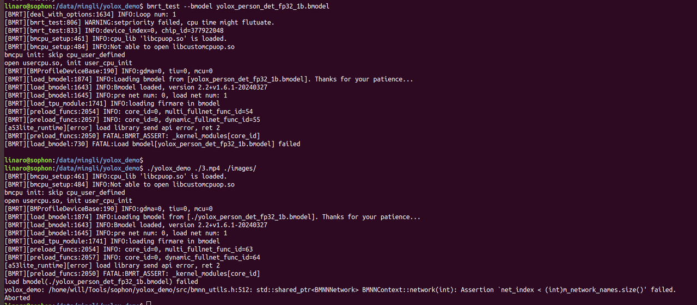

### 三十二、SE9接上HDMI后，为什么没有出现ubuntu的桌面？

答：SE9默认不安装ubuntu界面，如果需要ubuntu桌面系统，可以手动安装。

```Bash
# 建议安装较轻量的xfce4
# 桌面显示
sudo dpkg -r qt5-base
sudo apt update
# 安装xfce4时选择lightdm
sudo apt install xfce4

#安装过程程序会询问桌面管理器选择lightdm还是gdm3，选择lightdm
#安装完成后安装evdi to hdmi 应用层驱动
pip3 install dfss
python3 -m dfss --dflag=evdi_usb_hdmi
  
#这个命令会下载一个deb文件，我们用sudo dpkg -i 的命令安装这个deb包
sudo dpkg -i sophgo-bsp-evdi-usb-hdmi_v1.3.0.deb

#执行命令关闭自动休眠
sudo systemctl mask sleep.target suspend.target hibernate.target hybrid-sleep.target

#禁用默认SophonHDMI
sudo systemctl disable SophonHDMI
sudo systemctl disable SophonHDMIStatus
sudo reboot


# 如果遇到hdmi花屏则执行
sudo su
echo off > /sys/class/drm/card0/card0-DSI-1/status
exit
```

注意：ubuntu 界面会占用比较大的存储/内存空间。

### 三十四、SE9的SDK下载链接

答：SE9的SDK下载链接可以在官网找到，官网链接为https://developer.sophon.cn/site/index/material/101/all.html

其中，BM1688&CV186AH下的SDK为SE9能够使用的SDK，它与BM1684&BM1684X不是同一套。

### 三十五、如何查看模型属于单核模型还是双核模型？

答：有两种方式

- 使用tpu_model --info xxx.bmodel


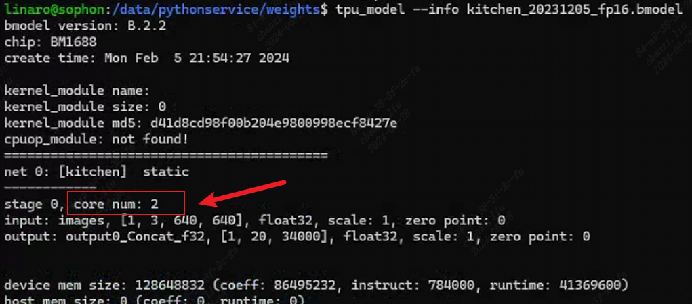

- 使用bmrt_test --bmodel xxx.bmodel


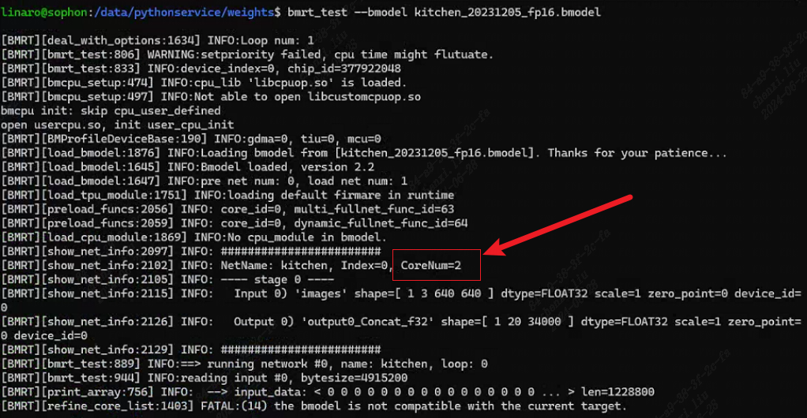

### 三十六、双核模型在SE9-8(CV186AH)上运行会如何？

答：双核模型没法运行在SE9-8(CV186AH)上。如果使用bmrt_test --bmodel xxx.bmodel，会报FATAL:(14)the bmodel is not compatible with the current target.

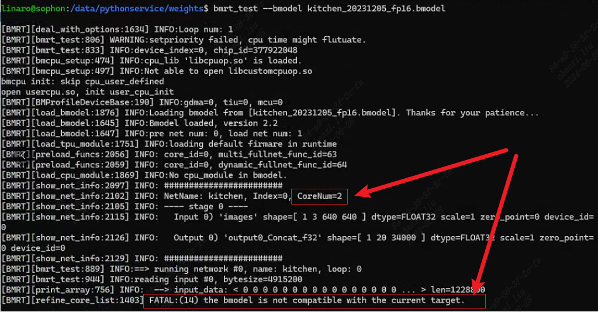

### 三十七、sophon-opencv和sophon-ffmpeg具体做了哪些硬件加速？

答:

sophon-opencv API 包含了所有FFMPEG 支持的硬件及软件视频编解码接口（视频底层通过FFMPEG 支持，这部分功能完全覆盖），硬件加速的JPEG 编解码接口，软件支持的其他所有图像编解码接口（即所有OPENCV 开源支持的图像格式），部分硬件加速的图像处理接口（指用图像处理VPP 模块加速的缩放、crop、padding、色彩转换功能），所有软件支持的OPENCV 图像处理功能。其中，硬件模块加速对图片和视频的处理主要是：

- 多媒体模块：硬件加速JPEG 编码解码和Video 编解码操作。
- BMCV 模块：硬件加速对图片的resize、color conversion、crop、split、linear transform、nms、sort 等操作。
- NPU 模块：硬件加速对图片的split、rgb2gray、mean、scale、int8tofloat32 操作。

sophon-ffmpeg API包含了所有硬件加速的视频/图像编解码接口，所有软件支持的视频/图像编解码接口（即所有FFMPEG 开源支持的格式），通过bm_scale filter 支持的部分硬件加速的图像处理接口（这部分图像处理接口，仅包括用硬件图像处理VPP 模块加速的缩放、crop、padding、色彩转换功能）。其中，通过硬件接口，提供了如下模块：硬件视频解码器、硬件视频编码器、硬件JPEG 解码器、硬件JPEG 编码器、硬件scale filter、hwupload filter、hwdownload filter

参考《算能边缘产品MULTIMEDIA开发参考手册》[SOPHGO OpenCV使用指南](https://doc.sophgo.com/bm1688_sdk-docs/v2.0/docs_latest_release/docs/multimedia/guide/guide/Multimedia_Guide_zh.html#sophgo-opencv)和[SOPHGO FFMPEG使用指南](https://doc.sophgo.com/bm1688_sdk-docs/v2.0/docs_latest_release/docs/multimedia/guide/guide/Multimedia_Guide_zh.html#sophgo-ffmpeg)

### 三十八、使用docker搭建测试环境

答：参考[《LIBSOPHON使用手册》使用Docker搭建测试环境](https://doc.sophgo.com/bm1688_sdk-docs/v2.1/docs_latest_release/docs/libsophon/guide/4_docker_usage.html)

### **三十九、盒子上运行sophon-demo python例程或cpp例程报decode failure问题**

答：用户权限问题，用linaro用户登录并运行即可

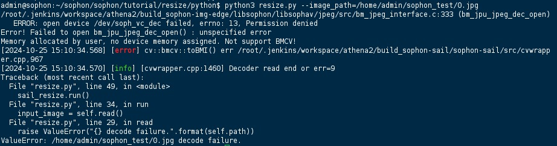

### 四十、如何修改liteos的web界面logo？

答：

1. /var/lib/sophliteos/dist/favicon.ico
2. /var/lib/sophliteos/dist/resource/img或者 /var/lib/sophliteos/dist/assets里面的png

换完后重启服务即可：systemctl restart sophliteos

### 四十一、如何修改HDMI配网工具界面LOGO？

答：

1. 打开脚本：/bm_services/SophonHDMI/run_hdmi_show.sh
2. 取消注释export SOPHON_QT_BG_PATH=sample.png，并设置为想要替换的LOGO
3. 重启服务：sudo systemctl restart SophonHDMI

### 四十二、SE9盒子安装桌面后，出现死机/休眠状态，怎么解决？

答：

安装xfce4桌面后，会自动启用休眠功能，需要关闭休眠功能：

```Bash
sudo systemctl mask sleep.target suspend.target hibernate.target hybrid-sleep.target
```

### 四十三、如何得到模型的算力占用情况

答：

1. 用TPU-MLIR转bmodel时，会生成一个compiler_profile.txt，最后一行会标出该模型的计算量
2. 在SE9上用bmrt_test --bmodel xxx.bmodel拿到运行时间
3. 用计算量除以时间，就是该模型在SE9上的算力占用

公式为：FLOPS / runtime(ms) *1e-9

```Bash
eg.
flops: 28883247200, runtime: 6.544257ms, ComputationAbility: 4.413526T
```

### 四十四、设备长时间运行，出现卡死、重启或报错问题

答：

内存总量为系统内存 + VPP内存 + TPU内存。分别查看是哪一部分的内存满了导致

```Bash
# 系统内存
free -h
# vpp内存，用于解码、算法预处理
sudo cat /sys/kernel/debug/ion/cvi_vpp_heap_dump/summary | head -3
# TPU内存，用于模型推理
sudo cat /sys/kernel/debug/ion/cvi_npu_heap_dump/summary | head -3
```

进一步排查可以使用[get_info工具](https://github.com/sophgo/sophon-tools/tree/main/source/pget_info)监控设备运行信息

### 四十五、运行yolov8/11系列模型报Only support OPT model

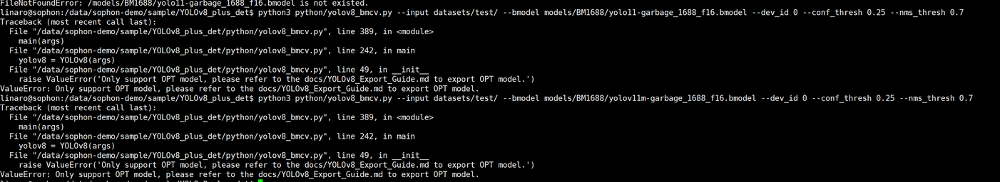

答：我们的代码为了提升效率，在模型最后加了一个转置，因此需要给bmodel也加一个转置

请参考重新导出onnx后转bmodel：https://github.com/sophgo/sophon-demo/blob/release/sample/YOLOv8_plus_det/docs/YOLOv8_Export_Guide.md

### 四十六、编译程序时，报GLIBC问题

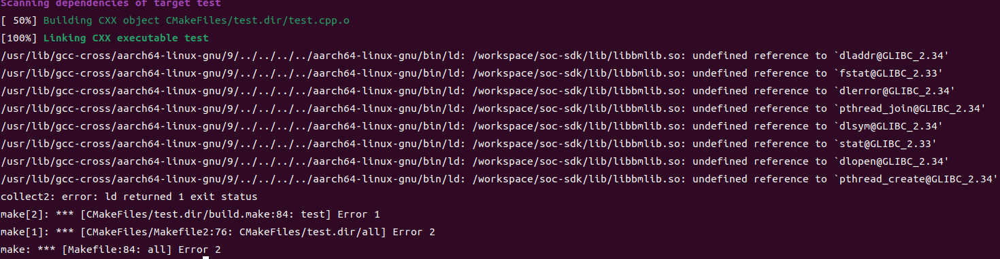

答：需要更换对应的gcc版本进行编译。SDK1.8.0及以下版本，使用gcc9交叉编译工具链，系统为ubuntu20.04，而SDK1.9.0及以上版本，使用gcc11交叉编译工具链，系统为ubuntu22.04。

我们也提供了[docker镜像](https://github.com/sophgo/sophon-demo/blob/release/docs/Environment_Install_Guide.md#41-%E4%BA%A4%E5%8F%89%E7%BC%96%E8%AF%91%E7%8E%AF%E5%A2%83%E6%90%AD%E5%BB%BA)作为交叉编译环境

### 四十七、运行python例子报No module named 'sophon'问题

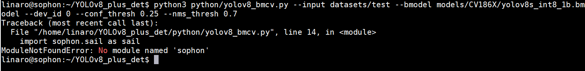

答：需要安装sophon-sail：

- 如果设备固件版本不小于2.0.0，可直接使用如下命令安装：

```bash
pip3 install dfss --upgrade
python3 -m dfss --install sail
```

- 如果设备固件版本小于2.0.0，则需要自行下载github源码[sophon-sail](https://github.com/sophgo/sophon-sail)并编译whl后安装即可.

### 四十八、sophon-demo常见问题：

答：https://github.com/sophgo/sophon-demo/blob/release/docs/FAQ.md

### 四十九、sophon-stream常见问题：

答：https://github.com/sophgo/sophon-stream/blob/master/docs/FAQ.md

### 五十、运行算法出现load library send api error，load model failed或net_indx < (int)m_network_names.size() failed问题

答：在设备上输入bm-smi命令查看chipT Status是active还是fault。如果是tpu fault，首先检查SDK固件版本是否为官网最新的版本，不是的话先升级到最新版本再测试问题是否还存在。如果问题还存在，联系技术人员，并提供：

- /var/log文件夹日志
- 能复现问题的bmodel

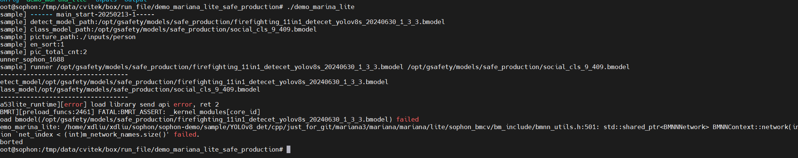
